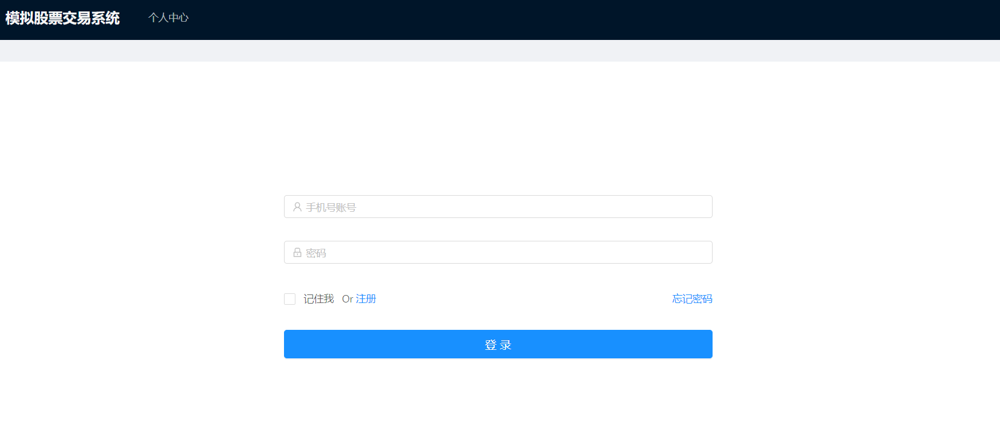
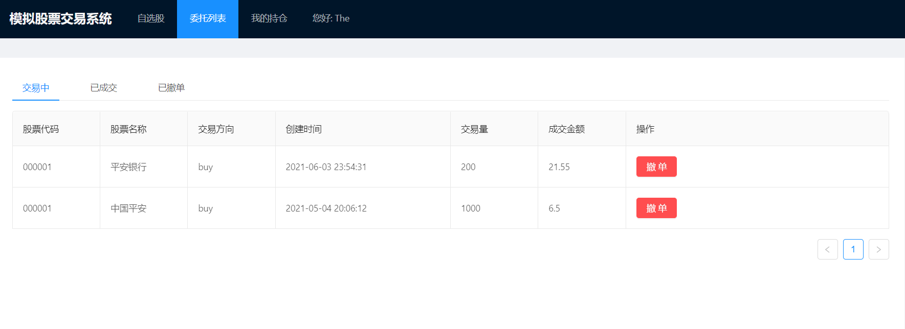
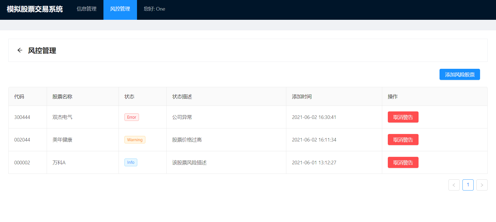

# 模拟股票交易系统-前端

前端采用Vue框架

### 项目说明

调用实际的金融数据接口，模拟股票交易

### 编译开发

```
npm run serve
```

### 上线部署

```
npm run build
```

### 普通用户界面

#### 登录和注册




#### 用户自选股


#### 委托订单



#### 行情K线图


#### 用户持股


#### 买卖委托交易


#### 用户个人信息


### 管理员界面

#### 用户管理


#### 股票风控预警



### 未完成功能

- 普通用户
  - 个人持仓（仅有界面）
  - 个人交易收益
- 管理员
  - 删除注册账户
